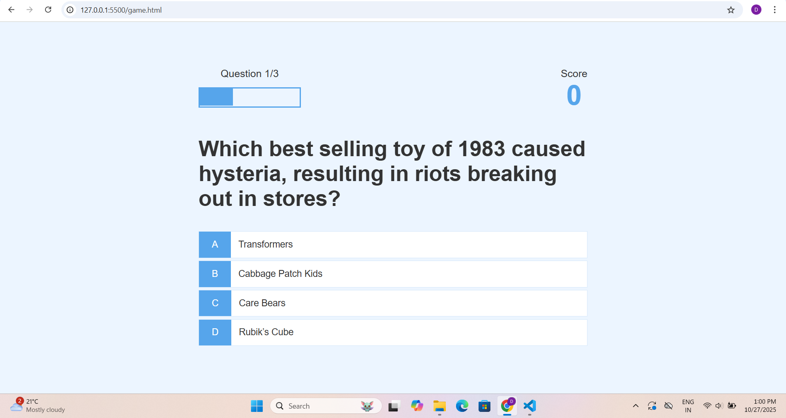

#  Quiz App  

##  Project Overview  
This Quiz App is a fun and interactive web-based application built using **HTML**, **CSS**, and **JavaScript**.  
It allows users to answer multiple-choice questions, track their scores, and improve their knowledge through a simple and engaging interface.

---

##  Features  
-  Displays multiple-choice questions  
-  Tracks and displays score and progress  
-  Saves high scores using **Local Storage**  
-  Includes a visual progress bar  
-  Fetches questions dynamically using the **Open Trivia API**  
-  Fully responsive design using **Flexbox** and **CSS animations**

---

##  Technologies Used  
- **HTML5** – Structure of the app  
- **CSS3** – Styling and layout  
- **JavaScript (ES6)** – Logic, APIs, and local storage  

---

## 📷 Screenshot  
*(You can replace this image with your own app screenshot)*  

---

##  How It Works  
1. Start the quiz from the home screen.  
2. Answer the questions one by one.  
3. View your score at the end.  
4. Save your high score and play again anytime!  

---

##  Learning Highlights  
This project helped in learning and practicing:  
- DOM Manipulation  
- Event Handling  
- Fetch API usage  
- Local Storage Management  
- Responsive Web Design  

---

##  Future Improvements  
- Add timer-based questions  
- Add more categories and difficulty levels  
- Include sound and animation effects  

---

